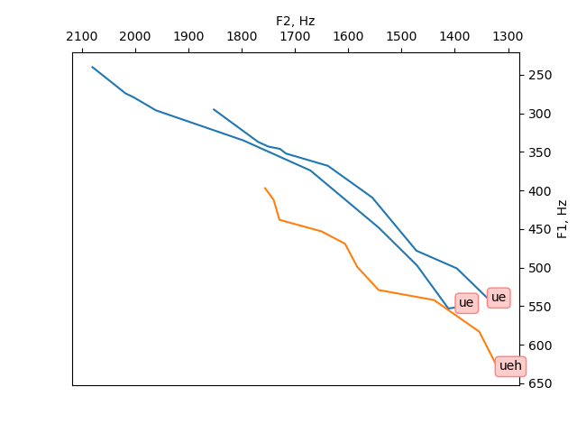

== Rendering vowel space with matplotlib

Inspired by https://github.com/ListenLab/make_vowel_space[ListenLab/make_vowel_space]

=== Usage
Prepare your data similar to the `example.txt` file in this repository:

 - whitespace separated
 - first row contains field names (also whitespace-separated)
 - first column -- vowel name (will be used for the captions on the graph)
 - the script uses columns called `v_time`, `F1`, `F2` for the plots, the rest are ignored

=== Example output

//=== License
//https://en.wikipedia.org/wiki/WTFPL[WTFPL]